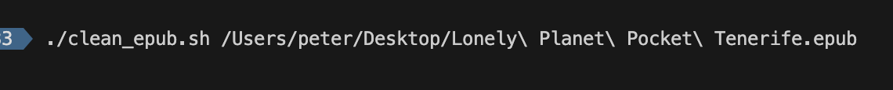
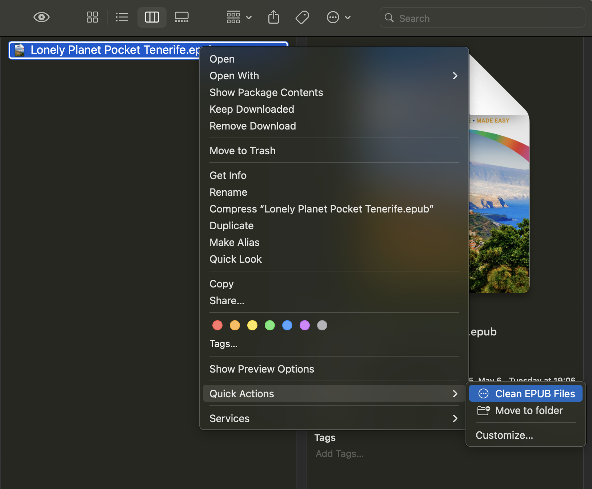

# Apple Books EPUB Cleaner

A tool to clean EPUB files exported from Apple Books by removing Apple-specific metadata. This tool was created after discovering that Apple Books' exported EPUBs often cause issues when uploading to Calibre-web and other self-hosted ebook library systems due to their non-standard format.

This is useful for anyone who wants to:

- Export EPUBs from Apple Books for use in other e-readers
- Remove Apple's DRM-free but proprietary metadata 
- Create clean, standard-compliant EPUB files
- Upload books to Calibre-web or similar self-hosted libraries
- Share EPUBs with users of other e-readers


This script can be run both from the command line and as an AppleScript action for seamless integration with macOS Finder.


## What This Does

The script cleans EPUB files by:
- Extracting the EPUB contents (EPUBs are ZIP files)
- Removing `iTunesMetadata.plist` if present
- Re-packaging the EPUB with proper compression
- Creating a new file with `_cleaned` suffix

## Files Created

`clean_epub.sh` - The main shell script that processes EPUB files
`EPUB_Cleaner.applescript` - AppleScript wrapper for macOS integration


## Setup Instructions 

### Step 1: Clone or download this git repository


### Step 2: Make the Shell Script Executable

Open Terminal and navigate to the directory containing `clean_epub.sh`:

```bash
cd /path/to/your/downloaded/directory
chmod +x clean_epub.sh
```


## Setup Options

### Option 1: Command Line Usage




For advanced users who prefer the command line:

1. **Make the script executable**
   ```bash
   chmod +x clean_epub.sh
   ```

2. **Run directly**
   ```bash
   ./clean_epub.sh file1.epub file2.epub file3.epub
   ```


### Option 2: Automator Quick Action (Recommended for non-technical users)




This creates a true right-click context menu item in Finder:

1. **Open Automator**
   - Press `Cmd+Space` and type "Automator"
   - Choose "Quick Action" when prompted

2. **Configure the Quick Action**
   - Set "Workflow receives current" to: **files or folders**
   - Set "in" to: **Finder**

3. **Add Shell Script Action**
   - Search for "Run Shell Script" in the actions library
   - Drag it to the workflow area
   - Set "Pass input" to: **as arguments**

4. **Add the Script Code**
   - Replace the default script with:
   ```bash
   #!/bin/bash
   
   # Get the directory where this workflow is saved
   # You'll need to update this path to where you saved clean_epub.sh
   SCRIPT_DIR="$HOME/services"  # Update this path!
   CLEAN_SCRIPT="$SCRIPT_DIR/clean_epub.sh"
   
   # Make sure the script is executable
   chmod +x "$CLEAN_SCRIPT"
   
   # Process each file
   for file in "$@"; do
       if [[ "$file" == *.epub ]]; then
           "$CLEAN_SCRIPT" "$file"
       fi
   done
   ```

5. **Save the Quick Action**
   - Press `Cmd+S`
   - Name it "Clean EPUB Files"
   - It will be saved in `~/Library/Services/` and immediately show up in Finder (right click on any file > Quick Actions)

6. **Update the Script Path**
   - In the shell script you just added, update the `SCRIPT_DIR` variable to point to where you saved `clean_epub.sh`


## Troubleshooting

### "Permission denied" errors
Make sure the shell script is executable:
```bash
chmod +x clean_epub.sh
```

### "Script not found" errors
- Update the path in the Automator workflow to point to your `clean_epub.sh` location
- Make sure both scripts are in the same directory

### No context menu item appears
- Make sure you saved the Automator workflow as a Quick Action
- Try logging out and back in to refresh the Services menu

### Files not processing
- Check that the files are actually EPUB files (.epub extension)
- Make sure you have write permissions in the directory
- Check the Terminal output for error messages

## Technical Notes

- The script preserves the EPUB format by adding the `mimetype` file first without compression
- Temporary directories are automatically cleaned up
- The script is safe - it never modifies original files
- Works with multiple files selected at once

## Customization

You can modify the shell script to:
- Change the output filename pattern (currently adds `_cleaned`)
- Remove other unwanted files from EPUBs
- Change the output directory
- Add additional processing steps 